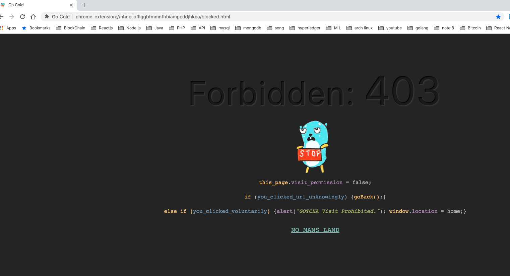

# Go Cold Website Blocker
[](https://github.com/huchenme/hacker-tab-extension/blob/master/LICENSE)

**Go Cold** is Chrome Browser Extension which you can use to block website with options to block it on timer or block it always. (You can also use it on FireFox Browser).
__If you like this extension please give a star.__

* [Why?](#why)
* [Installation](#installation)
* [Features](#features)
* [Build With](#build-with)
* [Contributing](#contributing)
* [License](#license)


## Why
Addiction to social media and video viewing & sharing platforms is common problem for lots of us.
Sometime involuntarily we tend to click or try to access those sites and go into deep loop and waste our time. It doesn't matter when you are free but it will definitely hampers when you are trying to concentrate in your studies while doing online research or for programmer during their work. In order to minimize this issue this Chrome Extension will block all the url you have listed on it on basis of timer or always.

## Installation
1. For People without Programming language knowledge:
* Go to this [release url]().
* Download the zip file and unzip it you will find js and html files inside that folder.
* Open Chrome browser and enter following url in search bar: chrome://extensions

* After that you will  see this page as show in image below which will list all extension available in you chrome browser and make sure Developer Mode is turned on as shown in image with Red arrow.

* Now after that Click on **Load Unpacked** button which is n top left corner and it will give option to choose file now choose folder you unzipped after downloading zipped file. Voila your extension has been loaded now you can use it easily.


1. For People with Programming language knowledge who want to build themselves:
* Clone the repository.
* Run following command to build source code:
```bash
npm run build
```
* From Chrome extension manager page click on **Load Unpacked** and select build folder to load extension.

## Features
1) Add domain to block list automatically.
* If you have already opened web page then if you click on extension you will get popup as shown in image below and domain will be automatically provided to block and you can click on + button to add it to block list. You will have option to Block it always which you can toggle with switch or change timer upto 60 minute (you can choose only one option).


2) Add domain manually
* Click on **ADD MANUALLY** button on below left corner to add manually

* After clicking it a form like below will show up where you can add domain name as you want and the domain name must be valid and can be added twice. Add it on timer or block always option will also available but you can only choose one.

* Now After clicking add if your blocked page is opened in your tab it will redirect to blocked page.

* Congratulation you have blocked domain successfully. Now if you try to open that url in any other tab it will load blocked page. 

3) View List
* To view list of blocked sites click on **VIEW BLOCKED LIST** button on below right corner.

* After clicking button you can view blocked page list. Where you can see how much time is remaining if time is set and if it is blocked always or not. You can go back to dashboard by clicking on **DASHBOARD** button.


4) Delete Page From Block List
* To delete pages from block list just click delete button corresponding to that page info.

5)Turn on Dark Mode
* To turn Dark Mode toggle dark mode switch on top left corner.


## Build With
1) React.js (Redux Saga)
2) React Material UI

## Contributing
Pull requests are welcome. For major changes, please open an issue first to discuss what you would like to change.

Please make sure to update tests as appropriate.


## License

Released under the MIT License - see `LICENSE.txt` for details.

